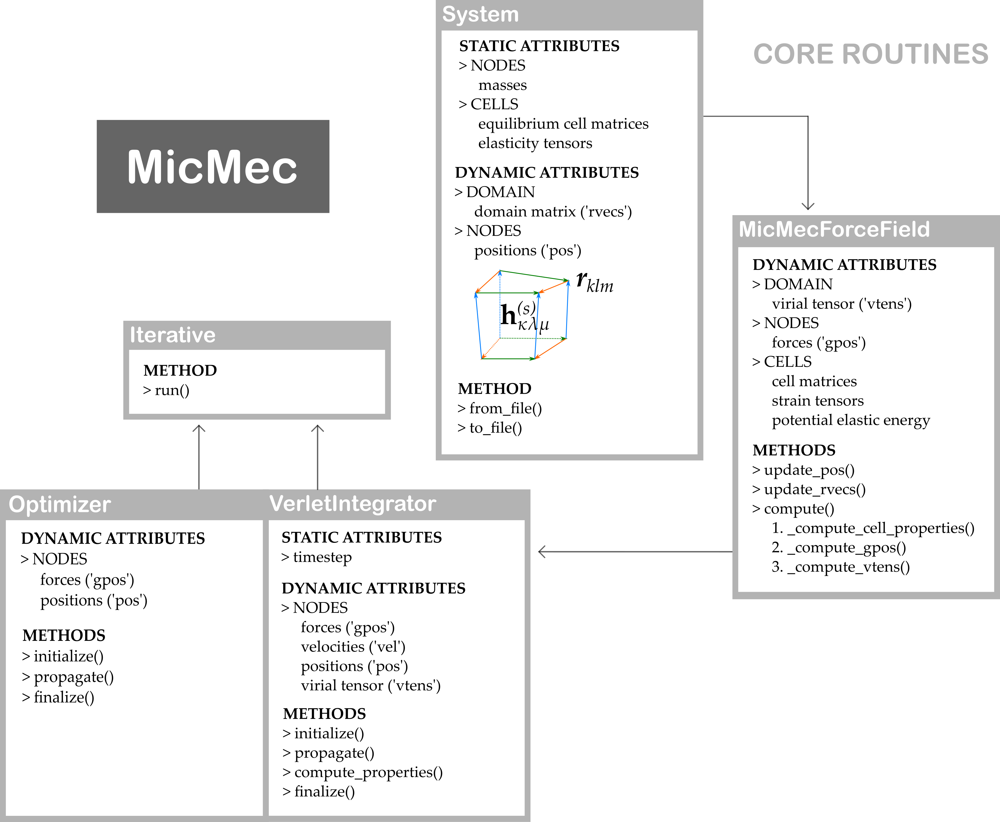

Performing simulations
######################

With a newly constructed micromechanical system, simulations can be performed. In the ``simulations`` directory, we have included four fully functional simulation scripts, which are accessed via terminal:

.. code:: bash

   python simulations/md.py data/uio66/struct/3x3x3_0.chk md_trajectory.h5
   python simulations/optimisation.py data/test/struct/3x3x3_test_shrunk_fbc.chk opt_trajectory.h5
   python simulations/static_scan.py data/test/struct/3x3x3_test_shrunk_pbc.chk
   python simulations/relaxed_scan.py data/uio66/struct/3x3x3_6.chk

Please note that these terminal scripts have a wide range of optional arguments. The ``md.py`` script, for instance, can be used to perform a simulation:

-   in the (N, V, E) ensemble, if no pressure or temperature are defined;
-   in the (N, V, T) ensemble, if only a temperature (``-temp``) is defined;
-   in the (N, P, T) ensemble, if a temperature (``-temp``) and a pressure (``-press``) are defined.

By studying these scripts carefully, it should become clear how most other simulations can be performed. The underlying mechanisms of the core routines of MicMec have been summarized in the following figure.

The black arrows indicate the order in which methods or instances are called. However, one important feature of MicMec has been omitted from this figure, namely, the following four scripts:

-   ``micmec/pes/nanocell.py``
-   ``micmec/pes/nanocell_jax.py``
-   ``micmec/pes/nanocell_thesis.py``
-   ``micmec/pes/nanocell_original.py``

One of these scripts is imported into ``micmec/pes/mmff.py`` to complete the micromechanical force field. By default, it should be the first script. These ``nanocell`` scripts each have the same goal: to calculate **the elastic deformation energy** and **the gradient of the elastic deformation energy** of a single metastable state of a nanocell. Prior to and during the development of MicMec, different methods were invented to obtain these values. The original implementation (``nanocell_original.py``) was based on: ::

    S. M. J. Rogge, “The micromechanical model to computationally investigate cooperative and 
    correlated phenomena in metal-organic frameworks,” Faraday Discuss., vol. 225, pp. 271–285, 2020.

In Joachim Vandewalle's thesis, another implementation was used (``nanocell_thesis.py``). Unfortunately, both of these implementations are flawed. The latest implementation (``nanocell.py``) has fixed all of its predecessors' flaws and should be the superior model. There exists yet another implementation, ``nanocell_jax.py``, which uses automatic differentiation to access a wide range of energy functions and just-in-time compilation for a speed boost. Curious readers could perform two static scans, one using ``nanocell.py``, the other using ``nanocell_jax.py`` and observe that both scans yield the same results. These two methods are therefore equivalent, but JAX is still quite slow.

